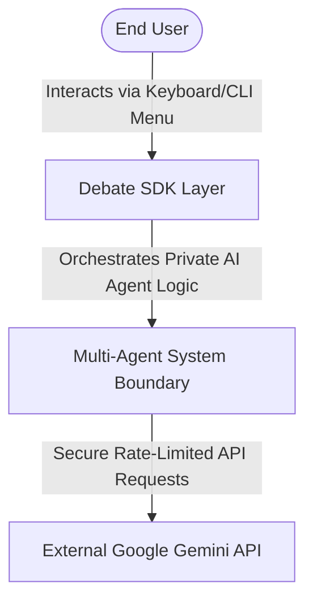

# Architectural Design Plan: Multi-Agent Debate System

## 1. System Architecture (C4 Model)
This section uses the C4 structural framework to detail the boundaries, containers, and core component responsibilities of the application.

### 1.1 System Context Diagram
The overall relationship between the end-user, the software system boundary, and the external Gemini API infrastructure.



### 1.2 Container Diagram
The logical decomposition of the system into distinct execution containers that isolate concerns.

```mermaid
graph TD
    subgraph "Client UI & Entry"
        Main[main.py: CLI Interface Loop]
        SDK[sdk.py: Unified Entry Facade]
    end

    subgraph "Service Tier (Domain Logic)"
        Orch[orchestrator.py: Judge Orchestrator Process]
        Agents[agents.py: Pro / Con Processing State]
        Mixins[agent_mixins.py: Search & Memory Context Utilities]
    end

    subgraph "Infrastructure Tier"
        Gate[gatekeeper.py: API Gatekeeper & FIFO Queue]
        Config[config_loader.py: Static File Config Manager]
        Log[logger.py: Structured Rotating File Logger]
    end

    Main --> SDK
    SDK --> Config
    SDK --> Orch
    Orch --> Agents
    Agents --> Mixins
    Orch --> Gate
    Agents --> Gate
    Gate --> Log
---

## 2. Process Flow & Inter-Process Interaction (UML)

This section charts the operational behavior and communication protocols governing the system components.

### 2.1 Debate Round Sequential Lifecycle

The synchronization sequence showing how Inter-Process Communication (IPC) is tightly managed via text-based JSON message buffers flowing through the Judge Orchestrator.

```mermaid
sequenceDiagram
    autonumber
    participant J as JudgeOrchestrator
    participant P as ProAgent (Process Thread)
    participant C as ConAgent (Process Thread)
    participant G as ApiGatekeeper

    Note over J,C: Debate Initialized with Dynamic Topic

    J->>P: Dispatch Turn Token (Includes Context JSON payload)
    activate P

    P->>G: Issue Request via Gatekeeper (Load API key from .env)
    G->>G: Verify Rate Limits & Enforce Timeout Limits
    G-->>P: Return Validated Response JSON

    P-->>J: Transmit Generated Argument Payload JSON
    deactivate P

    Note over J: Validate Payload Structure, Word Count & Tone

    alt Argument Validated Successfully
        J->>C: Forward Context & Turn Token JSON
        activate C

        C->>G: Issue Request via Gatekeeper
        G-->>C: Return Validated Response JSON

        C-->>J: Transmit Generated Argument Payload JSON
        deactivate C

    else Validation Failed (Watchdog Interception)
        Note over J: Trigger Watchdog Retry Routine
        J->>P: Return Rejection JSON & Enforce Local Turn Regeneration
    end
```

```markdown
### 2.2 Operational Deployment Diagram
The mapping of software artifacts to hardware filesystem directories and logical runtime environments.

```mermaid
graph TD
    subgraph Machine ["Host Machine: Target Hardware Execution Node"]
        subgraph Env ["Virtual Env: Python Runtime Environment (uv)"]
            Main["main.py Loop Engine"]
            SDK["src/sdk/ Layer Packages"]
        end

        subgraph Configs ["Configuration Specs: config/ Folder"]
            Setup["setup.json (Immutable Metadata v1.00)"]
            Rates["rate_limits.json (Rate Control Policies)"]
        end

        subgraph Filesystem ["Local Filesystem: data/ Folder"]
            Logs["logs/app.log (Rotating File, Max 500 Lines)"]
            Economics["results/token_logs.json (Cumulative Metrics)"]
            Output["results/final_decision.md (Final Evaluation)"]
        end

        Secret["Secret Vault: .env File (System Key Store)"]
    end

    Main --> Configs
    SDK --> Filesystem
    SDK --> Secret

---

## 3. Data Interface Contracts & JSON Schemas

To ensure structured Inter-Process Communication (IPC), all interfaces exchange data strictly through explicit JSON schemas.

### 3.1 Pro / Con Agent Argument Response Payload

```json
{
  "$schema": "http://json-schema.org/draft-07/schema#",
  "title": "AgentArgumentPayload",
  "type": "object",
  "properties": {
    "thought_process": {
      "type": "string",
      "description": "Internal chain-of-thought strategy text"
    },
    "argument_summary": {
      "type": "string",
      "maxLength": 150
    },
    "full_argument": {
      "type": "string",
      "description": "The argument targeted to the opponent. Strict limit of 100 words."
    },
    "addressed_opponent_points": {
      "type": "array",
      "items": {
        "type": "string"
      }
    },
    "sources_used": {
      "type": "array",
      "items": {
        "type": "string"
      }
    }
  },
  "required": [
    "thought_process",
    "argument_summary",
    "full_argument",
    "addressed_opponent_points",
    "sources_used"
  ]
}
```

### 3.2 Judge Orchestrator Rejection & Correction Payload

```json
{
  "$schema": "http://json-schema.org/draft-07/schema#",
  "title": "JudgeRejectionPayload",
  "type": "object",
  "properties": {
    "status": {
      "type": "string",
      "enum": ["REJECTED"]
    },
    "error_type": {
      "type": "string",
      "enum": [
        "WORD_COUNT_VIOLATION",
        "TONE_VIOLATION",
        "INVALID_JSON"
      ]
    },
    "violation_details": {
      "type": "string"
    },
    "correction_instruction": {
      "type": "string"
    }
  },
  "required": [
    "status",
    "error_type",
    "violation_details",
    "correction_instruction"
  ]
}
```

---

## 4. Architectural Decision Records (ADRs)

This section lists the engineering rationale, constraints, and structural compromises selected for this system.

### ADR 01: FIFO Queue for API Rate Limiting & Flow Control

- **Context:** High-frequency agent calls risk breaking provider quotas, causing unhandled network crashes.

- **Decision:** We reject unmitigated inline requests. All calls to `google.generativeai` must flow through a centralized API Gatekeeper implementing an asynchronous First-In-First-Out (FIFO) pipeline.

- **Consequences & Trade-offs:** This pattern slightly increases systemic execution latency when queues fill up. However, it completely prevents `429 Too Many Requests` API faults and ensures predictable execution flow under restrictive limits.

---

### ADR 02: Mixin-Based Agent Hierarchy vs. Monolithic Architectures

- **Context:** Pro and Con agents require different skills (e.g., search or fact-checking tools), but sharing identical baseline attributes means a standard monolithic implementation creates severe code duplication, violating the DRY principle.

- **Decision:** We implement a clean separation using Python class Mixins. Core state management lives in `BaseAgent`, while shared capabilities are modularly injected via isolated classes:

$$
\text{ConcreteAgent} \subset \text{BaseAgent} \cup \text{SearchMixin} \cup \text{ContextMixin}
$$

- **Consequences & Trade-offs:** Increases structural planning complexity upfront due to Python's Multiple Inheritance Method Resolution Order (MRO). However, it offers highly modular code where individual skills can be cleanly unit-tested in total isolation.

---

### ADR 03: "Write/Select" Summarization for Memory Optimization

- **Context:** Over a 10-round multi-agent debate, storing the raw token conversation history creates an exponential growth curve that threatens memory bounds and increases processing costs.

- **Decision:** We reject passing global message histories to the agents. We implement a strict context engineering mixin using a "Write/Select" summarization strategy.

- **Consequences & Trade-offs:** Historical data undergoes lossy compression, meaning minor rhetorical nuances from early rounds are discarded. However, it ensures token usage scales linearly rather than exponentially, guaranteeing the system safely satisfies fixed context parameters:

$$
\text{Active Context Payload} =
\text{System Prompt} +
\text{Compressed History Summary} +
\text{Current Rebuttal Target}
$$

---