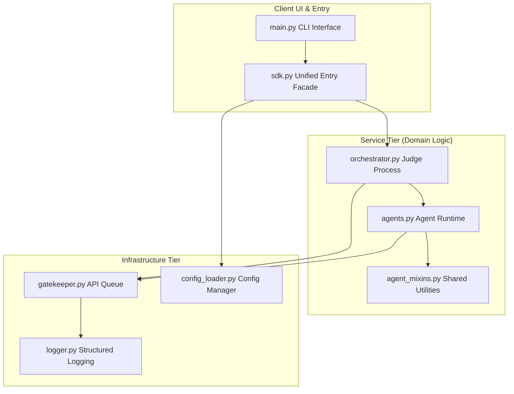
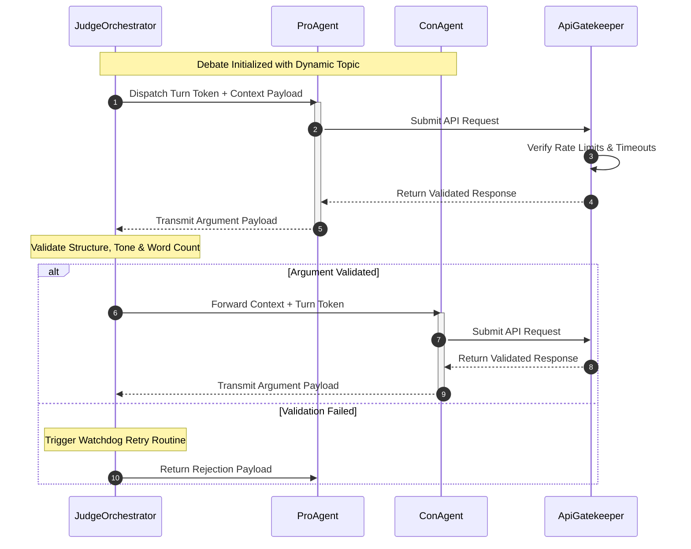
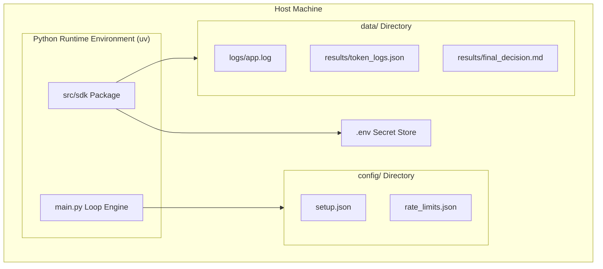

# Architectural Design Plan: Multi-Agent Debate System

## 1. System Architecture (C4 Model)

This section uses the C4 structural framework to detail the boundaries, containers, and core component responsibilities of the application.

---

### 1.1 System Context Diagram

The overall relationship between the end-user, the software system boundary, and the external Gemini API infrastructure.


---

### 1.2 Container Diagram

The logical decomposition of the system into distinct execution containers that isolate concerns.



---

## 2. Process Flow & Inter-Process Interaction (UML)

This section charts the operational behavior and communication protocols governing the system components.

---

### 2.1 Debate Round Sequential Lifecycle

The synchronization sequence showing how Inter-Process Communication (IPC) is tightly managed via JSON message buffers flowing through the Judge Orchestrator.



---

### 2.2 Operational Deployment Diagram

The mapping of software artifacts to hardware filesystem directories and logical runtime environments.



---

## 3. Data Interface Contracts & JSON Schemas

To ensure structured Inter-Process Communication (IPC), all interfaces exchange data strictly through explicit JSON schemas.

---

### 3.1 Pro / Con Agent Argument Response Payload

```json
{
  "$schema": "http://json-schema.org/draft-07/schema#",
  "title": "AgentArgumentPayload",
  "type": "object",
  "properties": {
    "thought_process": {
      "type": "string",
      "description": "Internal strategy reasoning"
    },
    "argument_summary": {
      "type": "string",
      "maxLength": 150
    },
    "full_argument": {
      "type": "string",
      "description": "Strict limit of 100 words"
    },
    "addressed_opponent_points": {
      "type": "array",
      "items": {
        "type": "string"
      }
    },
    "sources_used": {
      "type": "array",
      "items": {
        "type": "string"
      }
    }
  },
  "required": [
    "thought_process",
    "argument_summary",
    "full_argument",
    "addressed_opponent_points",
    "sources_used"
  ]
}
```

---

### 3.2 Judge Orchestrator Rejection & Correction Payload

```json
{
  "$schema": "http://json-schema.org/draft-07/schema#",
  "title": "JudgeRejectionPayload",
  "type": "object",
  "properties": {
    "status": {
      "type": "string",
      "enum": ["REJECTED"]
    },
    "error_type": {
      "type": "string",
      "enum": [
        "WORD_COUNT_VIOLATION",
        "TONE_VIOLATION",
        "INVALID_JSON"
      ]
    },
    "violation_details": {
      "type": "string"
    },
    "correction_instruction": {
      "type": "string"
    }
  },
  "required": [
    "status",
    "error_type",
    "violation_details",
    "correction_instruction"
  ]
}
```

---

## 4. Architectural Decision Records (ADRs)

This section lists the engineering rationale, constraints, and structural compromises selected for this system.

---

### ADR 01: FIFO Queue for API Rate Limiting & Flow Control

- **Context:** High-frequency agent calls risk exceeding provider quotas and causing network instability.

- **Decision:** All calls to `google.generativeai` flow through a centralized API Gatekeeper implementing an asynchronous FIFO pipeline.

- **Consequences & Trade-offs:** This introduces slight queue latency under load, but prevents `429 Too Many Requests` failures and ensures predictable execution flow.

---

### ADR 02: Mixin-Based Agent Hierarchy vs. Monolithic Architectures

- **Context:** Pro and Con agents require different capabilities while sharing core runtime behavior. A monolithic design would create unnecessary duplication.

- **Decision:** Shared functionality is modularized through Python Mixins. Core state logic resides in `BaseAgent`, while optional capabilities are injected separately.

```math
\text{ConcreteAgent} \subset \text{BaseAgent}
\cup \text{SearchMixin}
\cup \text{ContextMixin}
```

- **Consequences & Trade-offs:** Increases initial planning complexity due to Python MRO behavior, but enables highly modular and independently testable capabilities.

---

### ADR 03: Write/Select Summarization for Memory Optimization

- **Context:** Long multi-round debates cause exponential context growth and increased token costs.

- **Decision:** The system rejects full-history replay and instead uses compressed rolling summaries via a context-engineering mixin.

- **Consequences & Trade-offs:** Minor rhetorical nuances may be lost through lossy compression, but token growth becomes linear and bounded.

```math
\text{Active Context Payload}
=
\text{System Prompt}
+
\text{Compressed History Summary}
+
\text{Current Rebuttal Target}
```